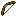
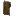

# Enchantments

Each enchantment in the table below includes attributes that are possible for the player to acquire legitimately in Survival mode.

* **Max Level**: Maximum levels for enchantments.
* **Primary Items**: The items that can receive the enchantment legitimately in Survival mode by using an enchanting table.
* **Secondary Items**: Items that, in Survival mode, cannot receive the enchantment from an enchanting table but can from an enchanted book with an anvil.
* **Weight**: Relative probability of the enchantment being offered.

You can edit enchantment attributes in their configuration files located in the **/enchants/** directory.

## Armor

| Name                 | Summary                                                                                                                    | Incompatible With                                           | Max Level | Primary Items                                                                                                                                     | Secondary Items                     | Weight |
| -------------------- | -------------------------------------------------------------------------------------------------------------------------- | ----------------------------------------------------------- | --------- | ------------------------------------------------------------------------------------------------------------------------------------------------- | ----------------------------------- | ------ |
| Cold Steel           | Applies [Mining Fatigue](https://minecraft.wiki/w/Mining_Fatigue) effect to the attacker.                                  |                                                             | III       |                                                                                                            |  | 5      |
| Darkness Cloak       | Applies [Darkness](https://minecraft.wiki/w/Darkness) effect to the attacker.                                              |                                                             | III       |                                                                                                            |  | 10     |
| Dragon Heart         | Grants passive [Health Boost](https://minecraft.wiki/w/Health_Boost) effect.                                               |                                                             | V         |                                                                                                            |  | 2      |
| Elemental Protection | Reduces potion and elemental damage.                                                                                       |                                                             | IV        |  |                                     | 10     |
| Fire Shield          | Ignites the attacker.                                                                                                      |                                                             | IV        |                                                                                                            |  | 2      |
| Flame Walker         | Ability to walk on lava, immunity to magma damage.                                                                         | [Frost Walker](https://minecraft.wiki/w/Frost_Walker)       | II        |                                                                                                                 |                                     | 1      |
| Hardened             | Grants [Resistance](https://minecraft.wiki/w/Resistance) effect on receiving damage.                                       |                                                             | II        |                                                                                                            |  | 5      |
| Ice Shield           | [Freezes](https://minecraft.wiki/w/Powder_Snow#Freezing) and [slows down](https://minecraft.wiki/w/Slowness) the attacker. |                                                             | III       |                                                                                                            |  | 10     |
| Jumping              | Grants [Jump Boost](https://minecraft.wiki/w/Jump_Boost) effect.                                                           |                                                             | II        |                                                                                                                 |                                     | 2      |
| Kamikadze            | Creates an explosion on death.                                                                                             |                                                             | III       |                                                                                                            |  | 5      |
| Lightweight          | Allows you to safely jump on turtle eggs, farmlands and big dripleaf.                                                      |                                                             | I         |                                                                                                                 |                                     | 10     |
| Night Vision         | Grants [Night Vision](https://minecraft.wiki/w/Night_Vision) effect.                                                       |                                                             | I         |                                                                                                                |                                     | 1      |
| Rebound              | Gives the effect of landing on a [Slime Block](https://minecraft.wiki/w/Slime_Block#Bouncing).                             | [Feather Falling](https://minecraft.wiki/w/Feather_Falling) | I         |                                                                                                                 |                                     | 2      |
| Regrowth             | Restores certain amount of hearts over the time.                                                                           |                                                             | IV        |                                                                                                            |  | 2      |
| Saturation           | Restores certain amount of food over the time.                                                                             |                                                             | II        |                                                                                                                |                                     | 2      |
| Speed                | Grants [Speed](https://minecraft.wiki/w/Speed) effect.                                                                     |                                                             | II        |                                                                                                                 |                                     | 2      |
| Stopping Force       | Reduces [Knockback](https://minecraft.wiki/w/Knockback_\(mechanic\)) when getting damage.                                  |                                                             | III       |                                                                                                              |                                     | 5      |
| Water Breathing      | Grants [Water Breathing effect](https://minecraft.wiki/w/Water_Breathing) effect.                                          |                                                             | I         |                                                                                                                |                                     | 1      |

## Bow

| Name               | Summary                                                                                                         | Incompatible With        | Max Level | Primary Items                    | Secondary Items                       | Weight |
| ------------------ | --------------------------------------------------------------------------------------------------------------- | ------------------------ | --------- | -------------------------------- | ------------------------------------- | ------ |
| Bomber             | Shoots [TNT](https://minecraft.wiki/w/TNT) instead of arrows.                                                   | Ender Bow, Ghast         | III       |  |  | 1      |
| Confusing Arrows   | Applies [Nausea](https://minecraft.wiki/w/Nausea) effect on arrows.                                             | Bomber, Ender Bow, Ghast | III       |  |  | 10     |
| Darkness Arrows    | Applies [Darkness](https://minecraft.wiki/w/Darkness) effect on arrows.                                         | Bomber, Ender Bow, Ghast | III       |  |  | 10     |
| Dragonfire Arrows  | Applies [Dragon's Breath](https://minecraft.wiki/w/Dragon's_Breath) effect on arrows.                           | Bomber, Ender Bow, Ghast | III       |  |  | 2      |
| Electrified Arrows | Summons [Lightning](https://minecraft.wiki/w/Thunderstorm#Lightning) on hit.                                    | Bomber, Ender Bow, Ghast | III       |  |  | 5      |
| Ender Bow          | Shoots [Ender Pearls](https://minecraft.wiki/w/Ender_Pearl) instead of arrows.                                  | Bomber, Ghast            | I         |  |  | 1      |
| Explosive Arrows   | Arrows [Explodes](https://minecraft.wiki/w/Explosion) on hit.                                                   | Bomber, Ender Bow, Ghast | III       |  |  | 5      |
| Flare              | Places a [Torch](https://minecraft.wiki/w/Torch) where arrow land.                                              | Bomber, Ender Bow, Ghast | I         |  |  | 5      |
| Ghast              | Shoots [Fireball](https://minecraft.wiki/w/Fireball) instead of arrows.                                         | Bomber, Ender Bow        | I         |  |  | 1      |
| Hover              | Applies [Levitation](https://minecraft.wiki/w/Levitation) effect on arrows.                                     | Bomber, Ender Bow, Ghast | III       |  |  | 10     |
| Lingering          | Arrows with a [lingering](https://minecraft.wiki/w/Lingering_Potion#Creating_area_effect_clouds) effect on hit. | Bomber, Ender Bow, Ghast | III       |  |  | 2      |
| Poisoned Arrows    | Applies [Poison](https://minecraft.wiki/w/Poison) effect on arrows.                                             | Bomber, Ender Bow, Ghast | III       |  |  | 5      |
| Sniper             | Increases projectile speed.                                                                                     |                          | II        |  |  | 10     |
| Vampiric Arrows    | Restores health on hit.                                                                                         | Bomber, Ender Bow, Ghast | III       |  |  | 2      |
| Withered Arrows    | Applies [Wither](https://minecraft.wiki/w/Wither_\(effect\)) effect on arrows.                                  | Bomber, Ender Bow, Ghast | III       |  |  | 5      |

## Tool

| Name          | Summary                                                                                      | Incompatible With                                               | Max Level | Primary Items                                                                                                                           | Secondary Items                                                                                         | Weight |
| ------------- | -------------------------------------------------------------------------------------------- | --------------------------------------------------------------- | --------- | --------------------------------------------------------------------------------------------------------------------------------------- | ------------------------------------------------------------------------------------------------------- | ------ |
| Blast Mining  | Mines blocks with [Explosions](https://minecraft.wiki/w/Explosion).                          | Tunnel, Veinminer                                               | V         |                                                                                                     |                                                                                                         | 2      |
| Glass Breaker | Breaks glass instantly.                                                                      |                                                                 | I         |                                  |                                      | 10     |
| Haste         | Applies [Haste](https://minecraft.wiki/w/Haste) effect on mining.                            |                                                                 | III       |                                  |                                      | 2      |
| Lucky Miner   | Produces more [XP](https://minecraft.wiki/w/Experience) from mined blocks.                   |                                                                 | III       |                                                                                                     |                                                                                                         | 5      |
| Replanter     | Replants [Crops](https://minecraft.wiki/w/Crops) on harvest or right-click.                  |                                                                 | I         |                                                                                                         |                                                                                                         | 1      |
| Silk Chest    | Drops [Chests](https://minecraft.wiki/w/Chest) that keeps their content.                     |                                                                 | I         |                                                                                                         |  | 1      |
| Silk Spawner  | Chance to obtain a [Monster Spawner](https://minecraft.wiki/w/Monster_Spawner).              | Smelter                                                         | I         |                                                                                                     |                                                                                                         | 1      |
| Smelter       | Smelt dropped items according to their [Recipes](https://minecraft.wiki/w/Smelting#Recipes). | [Silk Touch](https://minecraft.wiki/w/Silk_Touch), Silk Spawner | V         |                                  |                                      | 5      |
| Telekinesis   | Moves all block loot directly to inventory.                                                  |                                                                 | I         |  |                                                                      | 1      |
| Treefeller    | Cuts down an entire tree.                                                                    |                                                                 | I         |                                                                                                         |                                                                                                         | 2      |
| Tunnel        | Mines 1x2, 2x2, 3x3 area.                                                                    | Veinminer, Blast Mining                                         | III       |                                                                                                     |      | 1      |
| Veinminer     | Mines the whole ore vein at once.                                                            | Tunnel, Blast Mining                                            | III       |                                                                                                     |                                                                                                         | 1      |

## Fishing

| Name             | Summary                                                                                                    | Incompatible With | Max Level | Primary Items                              | Secondary Items | Weight |
| ---------------- | ---------------------------------------------------------------------------------------------------------- | ----------------- | --------- | ------------------------------------------ | --------------- | ------ |
| Auto Reel        | Automatically reels in a hook on bite.                                                                     |                   | 1         |  |                 | 1      |
| Curse of Drowned | Chance to fish up a [Drowned](https://minecraft.wiki/w/Drowned).                                           |                   | 3         |  |                 | 5      |
| Double Catch     | Increases amount of caught item by x2.                                                                     |                   | 3         |  |                 | 2      |
| River Master     | Increases casting distance.                                                                                |                   | 5         |  |                 | 10     |
| Seasoned Angler  | Increases amount of gained [XP](https://minecraft.wiki/w/Experience).                                      |                   | 3         |  |                 | 5      |
| Survivalist      | Automatically [cooks](https://minecraft.wiki/w/Cooking#Cooked_food_recipes) fish if what is caught is raw. |                   | 1         |  |                 | 2      |

## Weapon

| Name                | Summary                                                                                                                                        | Incompatible With | Max Level | Primary Items                        | Secondary Items                  | Weight |
| ------------------- | ---------------------------------------------------------------------------------------------------------------------------------------------- | ----------------- | --------- | ------------------------------------ | -------------------------------- | ------ |
| Bane of Netherspawn | Increases damage to [nether mobs](https://minecraft.wiki/w/The_Nether#Mobs).                                                                   |                   | V         |    |  | 10     |
| Blindness           | Applies [Blindness](https://minecraft.wiki/w/Blindness) effect on target.                                                                      |                   | II        |    |  | 10     |
| Confusion           | Applies [Nausea](https://minecraft.wiki/w/Nausea) effect on target.                                                                            |                   | II        |    |  | 10     |
| Cure                | Cures [Zombified Piglins](https://minecraft.wiki/w/Zombified_Piglin) and [Zombie Villagers](https://minecraft.wiki/w/Zombie_Villager) on kill. |                   | III       |    |  | 10     |
| Curse of Death      | If you kill a player, you have a chance of dying too.                                                                                          |                   | III       |    |  | 2      |
| Cutter              | Damages and drops target's armor.                                                                                                              |                   | III       |    |  | 2      |
| Decapitator         | Allows to obtain target's head.                                                                                                                |                   | II        |    |  | 2      |
| Double Strike       | Increases damage by twice.                                                                                                                     |                   | II        |    |  | 1      |
| Exhaust             | Applies [Hunger](https://minecraft.wiki/w/Hunger_\(effect\)) effect on target.                                                                 |                   | IV        |    |  | 10     |
| Ice Aspect          | [Freezes](https://minecraft.wiki/w/Powder_Snow#Freezing) and applies [Slowness](https://minecraft.wiki/w/Slowness) on target.                  |                   | III       |    |  | 10     |
| Infernus            | Tridens sets targets on fire.                                                                                                                  |                   | III       |  |                                  | 10     |
| Nimble              | Moves entity's drops directly to inventory.                                                                                                    |                   | I         |    |  | 2      |
| Paralyze            | Applies [Mining Fatigue](https://minecraft.wiki/w/Mining_Fatigue) effect on target.                                                            |                   | V         |    |  | 5      |
| Rage                | Grants [Strength](https://minecraft.wiki/w/Strength) effect in combat.                                                                         |                   | II        |    |  | 5      |
| Rocket              | Launches target into the space.                                                                                                                |                   | III       |    |  | 5      |
| Swiper              | Steals player's [XP](https://minecraft.wiki/w/Experience).                                                                                     |                   | III       |    |  | 2      |
| Temper              | Damage increases the more the less health you have.                                                                                            |                   | V         |    |  | 1      |
| Thrifty             | Drops mob's [Spawn Egg](https://minecraft.wiki/w/Spawn_Egg).                                                                                   |                   | III       |    |  | 2      |
| Thunder             | Summons [Lightning](https://minecraft.wiki/w/Thunderstorm#Lightning) on target with extra damage.                                              |                   | V         |    |  | 5      |
| Vampire             | Steals target's health.                                                                                                                        |                   | III       |    |  | 2      |
| Venom               | Applies [Poison](https://minecraft.wiki/w/Poison) effect on target.                                                                            |                   | II        |    |  | 10     |
| Village Defender    | Increases damage to [Illagers](https://minecraft.wiki/w/Illager).                                                                              |                   | V         |    |  | 10     |
| Wisdom              | Produces more [XP](https://minecraft.wiki/w/Experience) from mobs.                                                                             |                   | V         |    |  | 5      |
| Wither              | Applies [Wither](https://minecraft.wiki/w/Wither_\(effect\)) effect on target.                                                                 |                   | II        |    |  | 5      |

## Universal

| Name                | Summary                                          | Incompatible With                                                                        | Max Level | Primary Items                                                                                                                                                                                                                                                                                                                                                                                                                                                                                                                                                                                                           | Secondary Items                                                                                                                            | Weight |
| ------------------- | ------------------------------------------------ | ---------------------------------------------------------------------------------------- | --------- | ----------------------------------------------------------------------------------------------------------------------------------------------------------------------------------------------------------------------------------------------------------------------------------------------------------------------------------------------------------------------------------------------------------------------------------------------------------------------------------------------------------------------------------------------------------------------------------------------------------------------- | ------------------------------------------------------------------------------------------------------------------------------------------ | ------ |
| Curse of Breaking   | Takes more durability points on use.             | [Unbreaking](https://minecraft.wiki/w/Unbreaking)                                        | III       |  |                                                                                                                                            | 10     |
| Curse of Fragility  | Prevents item from being grindstoned or anviled. |                                                                                          | I         |  |                                                                                                                                            | 10     |
| Curse of Mediocrity | Disenchants block's and mob's loot.              |                                                                                          | III       |                                                                                                                                                                                                                                                                                                                                                                                                             |  | 5      |
| Curse of Misfortune | Reduces block's and mob's loot to zero.          | [Fortune](https://minecraft.wiki/w/Fortune), [Looting](https://minecraft.wiki/w/Looting) | III       |                                                                                                                                                                                                                                                                   |                                                                                                                                            | 5      |
| Restore             | Saves item from breaking once.                   |                                                                                          | III       |  |                                                                                                                                            | 2      |
| Soulbound           | Prevents item from being dropped upon death.     | [Curse of Vanishing](https://minecraft.wiki/w/Curse_of_Vanishing)                        | I         |  |                                                                                                                                            | 2      |
