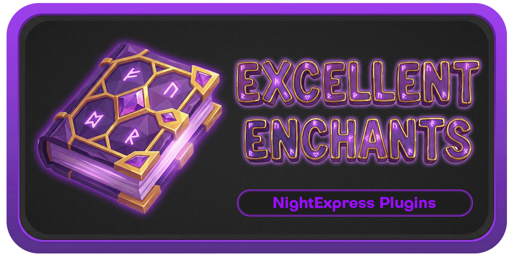
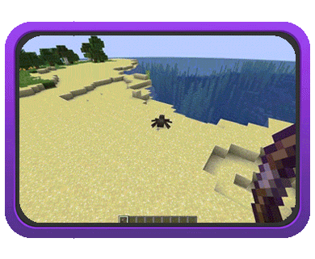
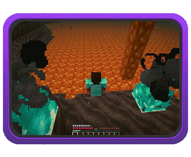
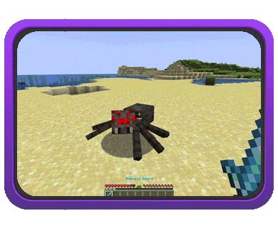
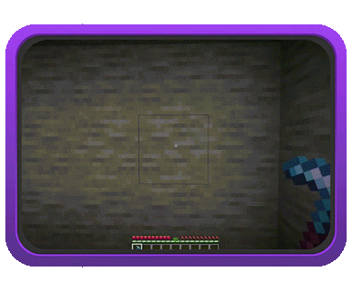
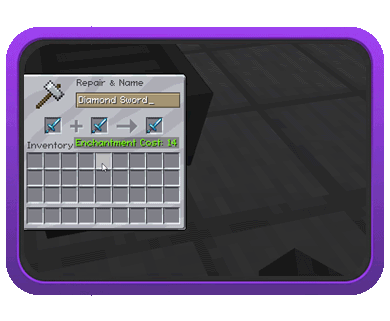
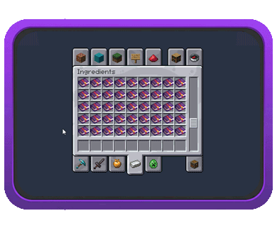
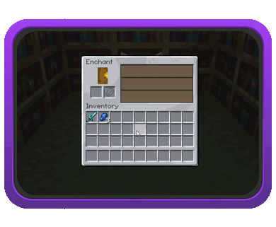
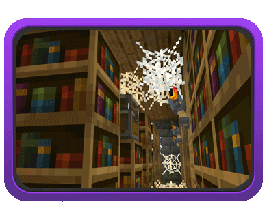

# Getting Started

**ExcellentEnchants** is a lightweight and modern enchantments plugin that adds **80+ vanilla-like**, fully customizable enchantments to your server.


[enchantments.md](enchantments.md)


   

## [#](getting-started.md#features) Features

### [#](getting-started.md#integration--compatibility) Integration & Compatibility

* [**Seamless Integration**](/broken/pages/9c4142f73b80ab687525bf477576ab9a1567d05f). Fully compatible with vanilla mechanics, commands, and other plugins.
* **Anvil & Grindstone Support**. Combine or remove custom enchantments just like vanilla ones.
* **Enchanted Books Support**. Access custom enchanted books directly from the Creative menu.
* [**PlaceholderAPI**](/broken/pages/ffe1f4fb4f7f7a15cf2b922d0ad8b7d3bc1a2d05) support.

 

### [#](getting-started.md#enchantment-distribution) Enchantment Distribution

* [**Enchanting Table**](/broken/pages/5e10e239ea9fefd2fbcd20503d8b86789ccfa364) & **Villager Trades**. Obtain custom enchantments through standard progression.
* [**Random Loot**](/broken/pages/5e10e239ea9fefd2fbcd20503d8b86789ccfa364). Find enchanted items in dungeon chests.
* [**Fishing**](/broken/pages/5e10e239ea9fefd2fbcd20503d8b86789ccfa364). Fish enchanted books with custom enchantments.
* [**Mob Equipment**](/broken/pages/5e10e239ea9fefd2fbcd20503d8b86789ccfa364). Mobs can spawn with custom-enchanted gear.

 

### [#](getting-started.md#customization--control) Customization & Control

* **Highly Customizable**. Modify attributes of any enchantment.
* **Overpowering Enchantments**. Allow enchantments to scale beyond max levels.
* **Exclusives**. Define incompatible enchantments per enchantment.
* [**Disable Enchantments**](/broken/pages/114a8bdaccd8e75fe8645574c403ada13bfc83e0). Disable enchantments globally or per world.

### [#](getting-started.md#item--equipment-support) Item & Equipment Support

* **Axes Support**. Apply sword enchantments to axes.
* **Crossbows Support**. Apply bow enchantments to crossbows by default.
* **Elytra Support**. Apply chestplate enchantments to elytras by default.
* [**Item Lists**](/broken/pages/cb35dfcb06f6ef6732768964a85764bac10e9e1d). Create custom primary & supported item lists for enchantments.

### [#](getting-started.md#user-interface--presentation) User Interface & Presentation

* **Enchantments GUI**. Customizable GUI for browsing all custom enchantments.
* **Colored Tooltips**. Customize tooltip colors for custom enchantments.
* [**Description Tooltip**](/broken/pages/612ff2ce47a16ab3ecbeb653daa42875b15e3e66). Display enchantment summaries in item tooltips.
* **Visual Effects**. Enchantments include particles and sound effects.

### [#](getting-started.md#advanced-mechanics) Advanced Mechanics

* [**Enchant Charges**](/broken/pages/4d419fb1d9d1c5f48aa23bdb32c8fbccb29682a4). Introduce charge-based mechanics for enchantments.
* [**New Curses**](/broken/pages/8257e750938b73b3154db85a93c7815a4157df9a). Additional curse enchantments beyond vanilla.

##
